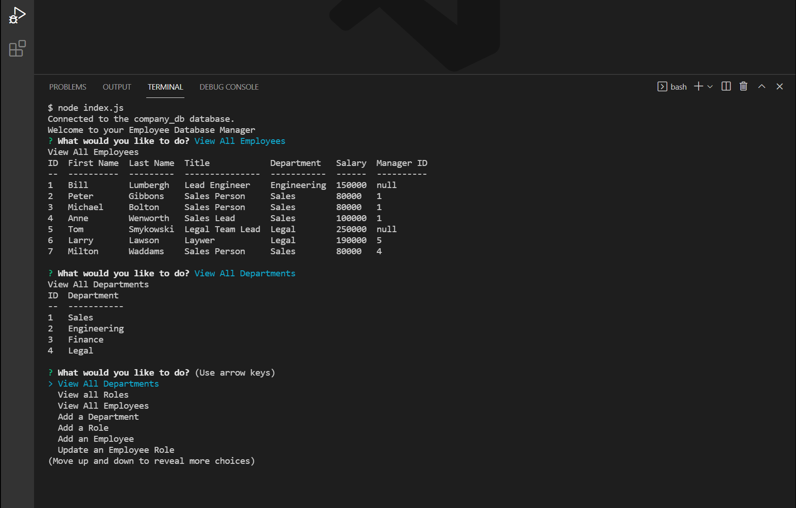

# EDM
* Employee Database Manager is a command line app that allows you to manage a database of your companies employees.

## Table of Contents

1. [Description](#description)

1. [Screenshot](#screenshot)

1. [Installation](#installation)

1. [Usage](#usage)

1. [Contributing](#contributing)

1. [Collaborators](#collaborators)

1. [Tests](#tests)

1. [Questions](#questions)

1. [Video Walk Thru](#sample)

## Description

* This application allows you as a business owner to view and manage departments, roles, and employees in your company so that you can orgainze and plan your business.

## Screenshot

## Installation

* Run the following to install dependancies, the following will be installed, express, inquirer, mysql2

> npm i

## Tests

* No command line tests are included in this application

## Usage

* The repo can be forked and then the required modules installed as per above.  The application is run from the command line by entering "node server.js"

## Contributing

* The project is finished and not considering contributions at the moment.

## Collaborators

* Ben Slinde - sole author

## Questions

* If you would like, you can connect with me thru my github profile [Github Profile](https://github.com/stevenslade)

## Video Instructions for using App 

* [EDM Walk Thru](https://salty-brushlands-66923.herokuapp.com/)

